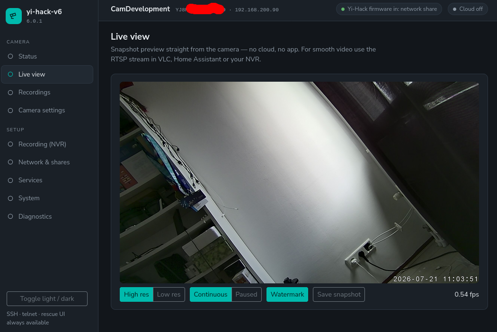

# Ultra-fast snapshots

    

*The redesigned live view — pick the resolution, run it continuously or pause it,
toggle the timestamp watermark, and watch the live frames-per-second.*

## Why did I change this

Taking a still picture used to be slow and memory consuming.
Previous versions didn't even allow you to watermark a high res image for performance and memory issues. The previous yi-hack decoded a frame of the video stream **in software**,
that could take many seconds for a full-resolution image.

The camera's video chip can already produce a ready-made JPEG in hardware, in a few
milliseconds. This firmware can now grab that JPEG directly instead of decoding the
video by hand — and the small web script that serves snapshots was trimmed so it no
longer wastes time around the capture itself.

## What you get

Snapshots — and the live view — are now near-instant. Measured on a Yi 1080p Home:

| What | Before (v5) | After (v6) |
| --- | --- | --- |
| One snapshot, full HD (1920×1080) | ~22 s (software decode) | **~0.15 s** (hardware) |
| One snapshot, low resolution | ~8 s (software decode) | **~0.04 s** (hardware) |
| Snapshot request | on demand | live view **a few images per second** |

## How to set it up

Open the web interface and go to **Services → Snapshots**. The **Snapshots** option
has three settings:

- **Off** — no snapshots (also disables the live view and the ONVIF snapshot).
- **Legacy** — the previous software method. Reliable everywhere; slower.
- **v6** — the new hardware-captured JPEG. Ultra fast.

New cameras use the fast **v6** mode where it has been verified for that model, and
**Legacy** everywhere else — so you always get working snapshots out of the box, and
can switch to **v6** yourself once you've confirmed it works on your camera.

As a side bonus: This also speeds up HomeAssistant when there is a movement detection...and you get notified faster.